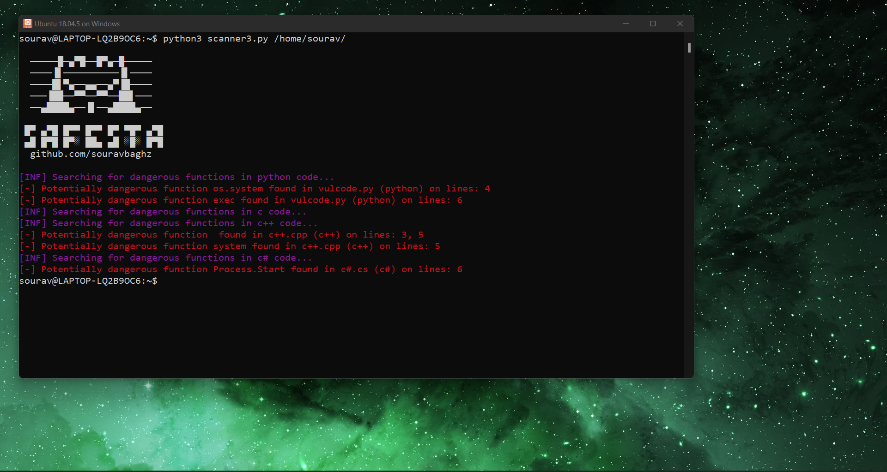

<p align="center">
  
</p>
<h2 align="center"><b>Dangerous Functions Finder</b></h3> 

#### Usage examples:
 ```
 python3 safesta.py -h 
 python3 safesta.py dir/to/codes/ 
```
 #### Results:
<p>
  
</p>
